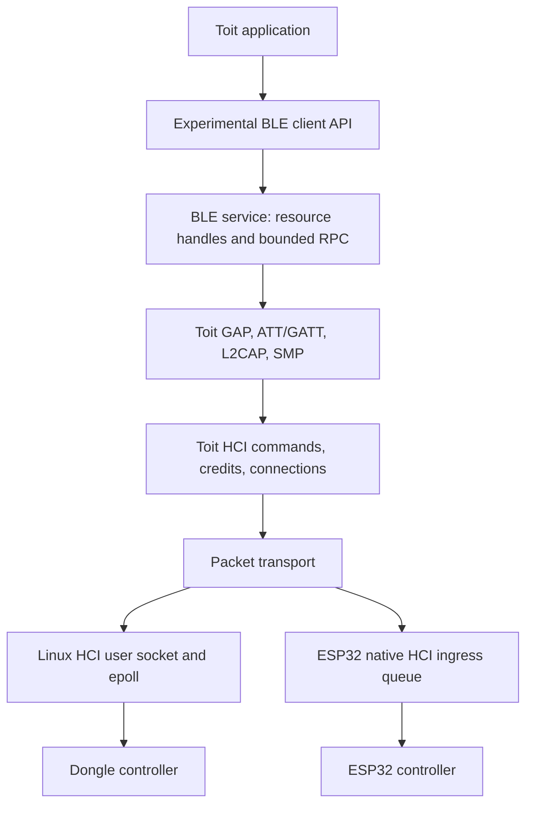

# BLE host in Toit

Status: experimental implementation in progress. Initial design dated 2026-09-07;
see [features](features.md) and [implementation evidence](progress.md) for current
coverage and remaining release gates.

Implement a BLE host in Toit above the standard Host Controller Interface
(HCI), retaining the hardware vendor's controller. Start on Linux with a
dedicated Bluetooth dongle and an ESP32 running the existing NimBLE backend
as an independent peer. Then run the same host code on ESP32.

The first useful result is a Toit program that scans, connects, discovers a
small service, reads and writes a characteristic, and receives notifications.
The [roadmap](roadmap.md) defines acceptance criteria and the transition from
this demonstration to a supported implementation.

## Scope and decisions

- Write HCI command handling, GAP policy, L2CAP, ATT, GATT, and eventually SMP
  in Toit. Keep radio timing, Link Layer, and link encryption execution in the
  existing controller. Reuse native cryptographic primitives for host security.
- Start with one adapter, one connection, legacy advertising, an unencrypted
  link, the default ATT MTU of 23, and one ATT bearer. These are prototype
  limits, not the final supported feature set.
- Add a small native HCI transport using the existing resource/event system.
  There is no new native host thread on Linux and no NimBLE host thread on
  ESP32. The ESP32 controller still has native tasks and callbacks.
- Keep protocol state in one Toit process, owned by a BLE service in the deployed
  design. The first sprint exercises the host directly to shorten the feedback
  loop; add a thin service boundary in step 5. Start with one long-lived receive
  task, the caller's task, and an additional task only where deadlines or
  application request handling need independent progress.
- Keep the current BLE implementations available while developing the new
  backend. Use a separate experimental import, proposed as `ble.experimental`.
  Review the API as features are implemented. Preserve useful concepts, but
  change semantics or names where the new service/lifetime model benefits.
- Implement only the commands and packet formats needed by each milestone.
  Use ordinary classes, byte arrays, monitors, and explicit state. Do not start
  with a protocol generator, generic actor framework, or new buffer framework.

## Hardware and platform boundary

Read-only inspection on 2026-09-07 found:

| Device | Observed state | Initial use |
| --- | --- | --- |
| Edimax USB Bluetooth adapter `7392:c611` | Linux `hci0`, driver `btusb`; address `08:BE:AC:2A:DA:C2`; LE and advertising listed as supported; currently powered | Controller for the new Linux host |
| ESP32 connection `/dev/ttyUSB8` | Serial device exists outside the sandbox; chip variant and firmware have not been queried | Existing NimBLE GATT peer, then target for the new host |

Adapter numbers and serial paths can change. The test setup must match the
recorded device identity before using them. Inspection did not take ownership
of the dongle, reset the board, or change firmware.

Linux uses `AF_BLUETOOTH` / `BTPROTO_HCI` with `HCI_CHANNEL_USER`. The kernel
continues providing the controller driver and transport; its Bluetooth host
processing is disabled for the selected adapter. This is exclusive ownership,
not a second host sharing the adapter with BlueZ. Use a test launcher to record
the initial powered state, power down that adapter before binding, and restore
it after closing. Do not stop the machine's entire Bluetooth service as the
default setup. Normal exit and recoverable failures must release ownership;
document recovery after an uncatchable process exit. [BlueZ HCI interface](https://github.com/bluez/bluez/wiki/HCI),
[Linux setup example](https://google.github.io/bumble/platforms/linux.html).

ESP32 uses the appropriate controller-only HCI interface for the identified
chip and bundled ESP-IDF revision. Start with VHCI where supported. Check
buffer lifetime, receive callback context, and flow control on that exact
target: these are not assumptions to generalize across the whole ESP32 family.
The bundled [VHCI example](../../third_party/esp-idf/examples/bluetooth/hci/controller_vhci_ble_adv/README.md)
and [controller API](../../third_party/esp-idf/components/bt/include/esp32/include/esp_bt.h)
are starting points. [Espressif HCI documentation](https://docs.espressif.com/projects/esp-idf/en/stable/esp32/api-reference/bluetooth/controller_vhci.html).

Windows and macOS system-adapter backends remain separate future work. A
dedicated external HCI controller can reuse the Toit protocol code there, but
ordinary system-adapter access is not an acceptance condition for this project.

The existing dongle plus ESP32 are enough for the sprint. A second Linux
dongle is useful later: leave it under BlueZ as an independent peer, test
multiple simultaneous connections, and retain a reference peer while flashing
the ESP32. Prefer a different controller family for interoperability coverage.
A second ordinary dongle is not automatically an over-the-air sniffer.

## Architecture

The direct sprint harness enters the host without RPC. The service owns the
same host implementation; it does not create a second protocol layer.

The transport deals in complete HCI packets, including a packet-type byte.
It exposes open, receive, send, and close, plus readiness and transport errors.
Linux sockets preserve packet boundaries. A later UART transport would assemble
H4 framing below this boundary; USB transport would normalize its endpoints to
the same packet representation. Do not implement those transports for the sprint.

Receive returns one owned byte array or waits for readiness. Send accepts one
packet and finishes when the transport has accepted its bytes. Neither operation
means that an HCI command or radio procedure has completed. The Toit HCI layer
handles those completions separately. A packet rejected for temporary transport
backpressure remains owned by Toit and is retried only when readiness changes.
An ambiguous/partial transmission fails the transport rather than silently
duplicating a command. Close is idempotent and wakes pending operations.

The Linux implementation should follow the resource and epoll integration in
[UDP](../../src/resources/udp_linux.cc), but must not copy its forced-external
allocation policy. The [UART receive primitive](../../src/resources/uart_posix.cc)
demonstrates allocating before consuming input.

## Execution, blocks, and cancellation

The receive task validates and dispatches packets in bounded batches, then
yields so other cooperative Toit tasks can run. It never calls an arbitrary
application handler inline. Waiting callers use monitors/latches and explicit
pending-operation objects; a slow GATT handler must not stall HCI processing.
Protect state transitions without holding a monitor across application code
or a wait for a controller response.

Prefer scoped block APIs for resource lifetime, scanning, notification
consumption, and serving requests. A scoped consumer loop invokes its block
on the caller's task while the receive task continues independently. Iteration
and packet decoding also use blocks. Blocks may remain on a suspended caller's
stack while the enclosing call is active; they must not be stored in a field,
queued, or captured by an escaping lambda.

For a persistent GATT server, use a handler object with methods, or a request
loop that calls a scoped block. Queue request data, not closures. A few lambdas
at long-lived task creation are acceptable: the SDK's [task API](../../lib/core/task.toit)
requires them. Avoid a new task/lambda for every packet or notification.

Across the service boundary, blocks stay in the client container. Send request
data and resource/request identifiers through RPC; the client invokes its local
block and submits a reply. The service tracks a pending ATT response with a
deadline while continuing its receive loop. Do not synchronously call back into
a client from the HCI dispatcher. An RPC completion is distinct from an ATT
response being transmitted or acknowledged.

Initially serialize HCI commands, honoring controller command credits. Distinguish
Command Complete from Command Status and the later event that completes an
asynchronous procedure such as connection creation. ACL transmit credits are a
separate controller-wide budget, not a full-sized counter per connection.
Connection-lifetime accounts charge a bounded quota against that shared budget.
Grant eligible waiters in arrival order; a connection already at its own quota
must not block another connection with available quota. Disconnect releases that
account's outstanding packets and invalidates its waiters before handle reuse
(Core 6.3 Vol 4 Part E 4.3). Local shutdown stops senders immediately but keeps
credits charged until controller completion/disconnection. The current configured
multi-link owner routes by handle and isolates link-local ATT/GATT and reassembly
failures. Controller framing/credit corruption or failed disconnection cleanup
still requires closing the owner. Two-peer radio validation remains pending.
Serialize ATT requests per connection/bearer while allowing
notifications and HCI events to progress.

Every pending operation has a deadline and a completion/error path. Cancellation
must cancel the underlying procedure where possible and account for late events.
Use a connection generation alongside the controller handle so a late local
request cannot affect a new connection that reuses that handle. If an HCI timeout
leaves command ownership uncertain, fail pending work and reinitialize rather
than guessing that the next response belongs to the next command. Never retry
an application write automatically after an uncertain completion.

The [cache policy](cache-policy.md) separates a layout sealed during connections
from one immutable for the device's lifetime. Defaults expose Service Changed
for firmware-upgradable devices. Client discovery records are connection-local;
automatic invalidation and bonded caching remain explicit implementation gates.

## Memory ownership and GC

A reported OOM is normally fatal in the SDK and may require a board reset.
General managed recovery after that point is best effort, not a critical design
requirement. Primitive allocation/GC retries are different: GC occurs at primitive
boundaries, so native receive and resource creation must remain retryable without
losing packets, leaking ownership, or retaining pointers into movable memory.
This priority was explicitly clarified by the maintainer on2026-09-11.

The advantage of Toit is that protocol objects, pending requests, values, and
packet bytes can share its managed heap. Application retention should not hold
scarce controller ingress slots indefinitely.

GC does not guarantee that allocation failure can be handled inside the same
process. Task startup, stack growth and exception handling also need heap space.
A minimal task/latch program with no BLE imports reproduces process termination
when its heap is exhausted before a background task starts
(`build/ble-reader-startup-pressure-001`). The BLE command-pressure regression
therefore distinguishes an established reader from startup under exhaustion.
Independently, ordinary provider-process death must release native resources;
successful catches in individual protocol methods do not establish that lifecycle
guarantee. Scoped S3 and original ESP32 tests now verify native
controller reopen after 12 such child-container deaths on each target
(see [native checks](native-checks.md)).
That does not make arbitrary task-startup OOM catchable or prove recovery on
every target and with active peer traffic.

[Process::allocate_byte_array](../../src/process.cc) already allocates bytes
internally unless forced external or larger than
`ByteArray::max_internal_size_in_process()`. That limit depends on heap block
size; do not hard-code a guessed threshold. [ByteArraySlice_](../../lib/core/collections.toit)
retains its backing array through an object reference, which is compatible
with moving that array.

RPC is a separate ownership boundary. The runtime currently inlines byte arrays
up to 128 bytes, but copies larger internal arrays into external storage in the
receiving process. Passing an already external array directly to RPC transfers
and neuters its source. The BLE client therefore snapshots outgoing arrays.
Returned application values remain owned but may be external; their bytes are
not necessarily compactable. Protocol ingress allocation inside the provider
does not have this RPC limitation. Process allocation counters include both
object-heap bytes and registered external allocations, not a managed-only total.

The current ESP32 callback ingress queue is a separate native cost:
`PacketQueue<8, 1029>` occupies 8,308 bytes, verified with the ESP32 cross-compiler
in `build/ble-memory-layout-001`. This excludes the surrounding resource object,
FreeRTOS wake queue and controller allocations. Do not infer the complete native
cost from process counters or this queue size alone. Reducing slots or packet
size changes overload tolerance or supported HCI packet bounds and requires
renewed queue-pressure and controller validation.

Use the following ownership rules:

1. **Linux ingress:** inspect the next packet's length without consuming it,
   validate it against the configured limit, allocate its managed array, then
   consume the packet into that array. Allocation failure returns through the
   VM's normal GC/retry path while the packet remains in the socket. Check
   truncation and enforce a single reader. Never dequeue and then perform an
   allocation whose failure would lose the packet.
2. **ESP32 ingress:** callbacks copy into a bounded preallocated native queue
   and signal the existing event mechanism. They do not allocate Toit objects,
   invoke application code, or wait for GC. The receive primitive allocates the
   managed destination before removing the native queue entry. Confirm the
   source pointer's lifetime in the controller transport implementation.
3. **Managed processing:** parse using an array plus offsets. Create views only
   when useful; copy a small retained value if a view would retain a much larger
   packet. Retained notification values own stable bytes that are never recycled
   under the application. Do not add a managed packet pool initially.
4. **Transmit:** keep queued packets in managed arrays until accepted. Borrow a
   raw pointer only during a native operation that cannot move the underlying
   object. If the controller retains the bytes beyond that call, copy them to a
   bounded native transmit buffer. No raw pointer into movable memory survives
   a primitive return, yield, or GC-capable operation.
5. **Size limits:** choose initial packet and reassembly bounds below the actual
   internal allocation limit where practical. Validate the controller's packet
   sizes against those bounds. Larger future values can use managed fragments;
   introduce that complexity only when needed. Do not silently force all traffic
   external to accommodate a future maximum.
6. **Write state:** allocate response bytes and accepted-write records before
   publishing values, subscriptions or prepared fragments. GC can retry an
   allocation, but it cannot undo an already-published value when allocation
   ultimately fails. The commit section must keep the value and its write record
   consistent without further allocation. This does not make response delivery
   atomic with the state change: a link can still disappear after commit, so a
   client must treat lost acknowledgments as uncertain completion.

GC is responsible for ordinary object lifetime, not protocol credits or prompt
cleanup. Release logical receive capacity when data is consumed or admitted to
another bounded stage, not when a finalizer happens to run. Close connections
and transports deterministically; finalizers are a fallback.

All queues, including managed notifications and pending application requests,
have packet/byte or operation limits. Controller-to-host ACL flow control, where
supported, must reflect capacity across these stages. Simply granting more
credits after copying into an unbounded Toit queue moves the exhaustion problem.
Keep HCI command credits, ACL transmit credits, ACL receive capacity, and
transport readiness distinct.

Reserve ingress capacity for essential control events. Advertising reports may
be dropped under load with counters; they cannot use all control-event slots.
Do not silently discard connection data. If capacity cannot be protected by
verified flow control, fail the affected connection or reset the transport with
an explicit overflow error. This is preferable to an apparently healthy stream
with missing bytes. Scanning never promises lossless reception.

Measure ingress high-water marks, drops, external bytes, managed live bytes,
GC counts, compacting-GC counts, and operation latency. The SDK already exposes
GC statistics through [system.process-stats](../../lib/system/system.toit).
An ordinary full GC is not evidence that a compacting GC actually happened.
Tune native buffer capacity from measured arrival bursts and GC/scheduling
pauses; shrinking native buffers to zero is not a design goal.

## Protocol progression

| Layer | Sprint behavior | Subsequent work |
| --- | --- | --- |
| HCI | Reset, identity/capabilities, event masks, command credits, LE scan/connect/disconnect, ACL credits | Recovery, broader feature detection, controller quirks |
| GAP | Explicit scan/connect; one peer; preserve address and address type | Advertising/peripheral role, privacy, multiple connections, policy |
| L2CAP | Basic fixed ATT channel; bounded ACL fragmentation/reassembly; minimum required LE signaling | Broader signaling and optional channels only when required |
| ATT/GATT | Client discovery for the demo, reads, write requests, CCCD subscription, notifications, MTU 23 | Server, MTU negotiation, long values, indications, caching semantics |
| SMP | Reject pairing explicitly; report security-required errors | Pairing, encryption policy, persistent bonds, privacy |

Handle unknown or unsupported requests with the protocol-defined response when
required. Test fragmentation even if the first small-value demo happens to fit
in one ACL packet. Validate lengths before accessing bytes or allocating from
untrusted lengths. Controller capability/version discovery determines which
commands may be issued; referencing a newer specification does not imply the
controller supports its newer features.

Security work retains trusted native AES/ECC/random primitives. Toit owns SMP
state, policy, and bounded message parsing. Secure Connections Just Works must
not be described as authenticated/MITM-protected pairing. Persistent keys must
use an appropriate storage mechanism and stay out of ordinary traces. The
prototype has no claim of security or production readiness.

## Placement and evolution

Proposed initial locations, to be adjusted to build-system conventions during
implementation:

- `lib/ble/experimental/`: entry point, HCI, transport wrapper, GAP, L2CAP,
  ATT/GATT. Add SMP when implementing security.
- `src/resources/ble_hci_linux.cc` and later `ble_hci_esp32.cc`: narrow native
  transport primitives, sharing declarations only where genuinely needed.
- `tests/ble-hci-*-test.toit`: codecs, fake transport, state transitions,
  cancellation, and bounded malformed input tests.
- `tests/hw/`: explicitly selected hardware scenarios, following the current
  rig conventions without assuming the old two-board wiring.
- `examples/ble/`: scan and echo demos plus an existing-backend reference peer.

A scripted in-memory transport and controllable time source should exercise
the same host code as hardware. Keep them small and add scenarios alongside
features. Preserve HCI traces with direction/timing and milestone results so
failures can become deterministic regression cases. Use standard btsnoop output
when adding a trace exporter; until then a bounded packet log is enough.

## Existing API: retain the shape, review the semantics

Initial review covered [ble.toit](../../lib/ble/ble.toit),
[remote.toit](../../lib/ble/remote.toit), and [local.toit](../../lib/ble/local.toit).
The current central/peripheral distinction, service/characteristic/descriptor
objects, UUID/advertisement helpers, and synchronous-looking operations are a
useful starting point. Scanning and local request handling already use scoped
blocks. The new host does not need a wholesale new object model.

Review the following points as their features land; these are proposals, not
final API signatures:

| Current API behavior | Direction for the new API |
| --- | --- |
| `Adapter` defaults to the first adapter; closing it closes its managers | An application opens a service session with explicit adapter selection when needed. Closing a session releases its resources, not other clients' adapter access. |
| `Central.scan` and local request handlers accept blocks | Preserve these idioms. Execute blocks locally in the caller, with cancellation and cleanup on every exit. Use `Duration` consistently for public timing options. |
| `connect` accepts a platform-dependent `identifier/any` | Keep an opaque peer identity at the portable API boundary; expose typed address/type metadata where available. Avoid making a MAC address a universal identity requirement. |
| Remote `write` chooses request/command from characteristic properties; `subscribe` prefers notifications over indications | Let the caller select acknowledged writes or commands, and notifications or indications when both exist. Document exactly what completion means. |
| `subscribe`, `wait-for-notification`, and `unsubscribe` are separate operations | Add a scoped subscription or closeable subscription object with bounded delivery, cancellation, and explicit overflow behavior. |
| Local `write` both updates a value and publishes; local `read` waits for incoming writes | Prefer clear operations for setting a value, publishing a notification/indication, and receiving a write request. Keep convenience operations only where their effects are unambiguous. |
| The local write path documents accumulated input data | Preserve ATT message boundaries, including empty values, in the new request/notification API. Offer stream-like concatenation explicitly if applications need it. |
| Local request blocks receive limited context | Provide peer/session identity, offset, request kind, and a way to return an ATT error. Bound request lifetime and reject late replies after disconnect or timeout. |
| `--secure` couples securing a connection with bonding | Make encryption, authentication, and bond persistence explicit policy choices. Report achieved security separately from requested policy. |

Use distinguishable errors for timeout, disconnect, unsupported capability,
security failure, ATT rejection, and overload; the exact Toit representation can
follow existing SDK conventions. Keep protocol attribute handles distinct from
UUIDs and service resource handles. Controller/native handles should remain
implementation details except in diagnostic interfaces.

For each change, compare a short existing-style example with the proposed form,
then test its success, cancellation, and failure behavior. Review scan/connect
before step 3, data transfer before step 4, and serving/RPC before step 5. Step 9
consolidates the public API and migration notes; it is not the first API review.
Compatibility is a preference, not an acceptance requirement for preserving
ambiguous semantics or platform-specific implementation details.

The current operation-by-operation comparison and remaining implementation work
are recorded in the [API migration inventory](api-migration.md).

## Service ownership and tree shaking

One BLE service process owns each controller and arbitrates access for application
containers, following the resource/lifecycle model in
[system.services](../../lib/system/services.toit) and the
[network provider](../../system/extensions/shared/network_base.toit). Keep the
selector/method definitions, client facade, and provider implementation separate
so importing a client does not pull provider code into an application.

The [mixed-role service plan](mixed-role-services.md) describes the next sharing
increment and its cancellation/security gates. Current peripheral sessions remain
exclusive until those gates pass.

Use `ServiceResource`/`ServiceResourceProxy` for connections and subscriptions,
with prompt cleanup on client closure/death. The provider keeps HCI, L2CAP, ATT,
and SMP inside its process. RPC carries application values and requests; measure
the copies and apply per-client quotas. Use bounded delivery with explicit
acknowledgment/pull behavior as needed, rather than assuming pushed RPC
notifications are naturally bounded. Do not promise cross-process sharing of
movable arrays or transfer native transport ownership to clients.

**Tree shaking acts independently on each container.** A scan-only application
can omit unused client methods, but cannot shrink an already compiled BLE service
whose dispatcher exposes the full API. Runtime flags or rarely used RPC method
indexes do not by themselves make code unreachable.

Start with one service implementation. Keep feature boundaries clear enough to
build a few concrete provider variants later if their measured size warrants it:

| Provider build | Components made reachable |
| --- | --- |
| Scan-only | HCI initialization, scanning, report decoding, lifecycle/error handling |
| Central | Connection control, L2CAP/ATT client, GATT discovery; security as selected by the build's declared feature set |
| Full | Central and peripheral roles, ATT/GATT server and selected security features |

Each build entry point constructs only the components it serves. Its dispatcher
must also refer only to those implementations; an omitted method returns a small
unsupported-operation error without referencing its full implementation. Avoid
a universal handler table that retains every protocol/role handler, and avoid
an all-features host constructor. Keep common error handling and mandatory
protocol responses reachable for every included role. Optional standard-service
codecs should not be registered globally; using a custom byte-value service
should not pull in all standard GATT value decoders or a huge names database.

These are **alternative builds of the controller-owning service**, not three
services competing for one adapter. Their capabilities are discoverable so a
client fails clearly when a requested operation is absent. Build-time feature
selection must also agree with the host features reported to the controller.
Do not label a security-free prototype build as a production secure BLE service.

Before claiming a saving, compile representative clients/providers, compare
container sizes, and inspect retained code. Measure service and client sizes
separately, plus the whole firmware image: Toit container tree shaking does not
automatically remove compiled native VM primitives, controller firmware, or
shared runtime dependencies. First ship a general provider; add a variant only
when there is a demonstrated deployment need.

Separately installable scan/GATT/security services could theoretically share a
lower controller-owning service, but would add RPC to the protocol path, shared
state coordination, and extra heaps. Do not split protocol layers into containers
for speculative size savings. Revisit only if variant measurements and real
deployment needs justify that tradeoff.

## Specification baseline and unresolved measurements

Use Bluetooth Core Specification **6.3** as the reference edition, with its
applicable corrections, plus Core Specification Supplement v15, Assigned Numbers,
and the GATT Specification Supplement. The user-provided PDFs have been checked
for editions, coverage, and searchable text; the [reference inventory](references.md)
records their exact versions, inspection date, and checksums. Keep these local
reference PDFs outside source commits. The reference edition is separate from the
eventual declared conformance configuration and supported feature subset.
[Official Core 6.3](https://www.bluetooth.com/specifications/specs/core-specification-6-3/),
[public HTML](https://www.bluetooth.com/wp-content/uploads/Files/Specification/HTML/Core_v6.3/out/en/index-en.html).

The principal implementation references are Core Vol 4 Part E (HCI), Vol 3
Parts A/C/F/G/H (L2CAP/GAP/ATT/GATT/SMP), and the advertising-data definitions
in the Supplement. Cite exact sections beside protocol rules and regression
tests as they are implemented. The local complete Core PDF is searchable,
including HCI command definitions and the required host protocol chapters.

Resolve these questions with milestones rather than speculative abstractions:

- Does this dongle allow user-channel ownership and clean restoration after
  kernel firmware initialization? What ACL sizes/credits does it report?
- Which ESP32 chip is on `/dev/ttyUSB8`, and which controller transport and
  receive-flow-control behavior does the bundled IDF provide for it?
- What ingress burst and GC pause bounds occur on that ESP32 under real load?
- Does managed packet allocation reduce external memory pressure at useful
  throughput, and do retained values survive observed compaction correctly?

These measurements can change buffer counts and limits without changing the
HCI boundary or the decision to keep host protocol state in Toit.

### Dynamic serving block lifetime

The experimental server now distinguishes a dynamic read reply from an
accepted-write hook. `serve-with-reads` receives two scoped blocks: the first
replies to a `ReadRequest` or selects an ATT error, and the second observes
already-acknowledged writes. Replies have a deadline and become invalid when
the block returns. A write hook cannot retroactively reject a write. `serve-with-requests` adds a
third scoped block for pre-commit validation of values marked `--validate-write`.
Queued transactions validate their final values before any transaction mutation.
Validation blocks should decide acceptance; application actions belong in the
accepted-write hook. Arbitrary side effects performed by a validator cannot be
rolled back by the attribute database.

A peer disconnect during an application block cancels the task executing the
serving operation, runs its `finally` cleanup, and invalidates outstanding read
replies. Another task can reuse the host afterward. A disconnect while waiting
for protocol input returns normally. This uses one Toit watcher task per serving
connection and preserves scoped blocks without per-request escaping closures.
The service provider must preserve this distinction across RPC: provider/session
ownership survives a failed serving task, while request tokens expire with the
connection and cannot be used for late replies.

### Initial service implementation

`lib/ble/experimental/service/` separates the selector/index definitions, client
facade, bounded request mailbox, RPC resource ownership, and GATT provider. The
experimental selector is `9d28731e-2a9f-4b19-adf7-39717fae7622` at version 0.4.
Applications can now open a database builder with `Client.configure`, add services
and characteristics, and receive provider-assigned handles. `Session.start`
freezes its configuration and begins advertising. There is one active session
per provider, including builders that have not started. Its controller is opened
by the serving task only after start, and released when that session finishes
or its client closes. Deployment-configured sessions remain available through
the original `Client.session` entry point.

The mailbox holds at most one pending application request. A pull returns
`[token, kind, attribute-handle, opcode, deadline, value]`. A reply carries the
token, ATT error code, and optional read value. Tokens increase within a session,
and the RPC service resource handle binds them to their owning client. The
provider validates token lifetime, reply kind, and the 20-byte limit. It copies
values on mailbox entry, delivery, and reply; RPC serialization and the ATT
engine add their own ownership boundaries. These explicit copies are an initial
correctness choice, not a measured optimum. Native handles never cross RPC.

Read and write-validation forwarding shares the ATT handler's deadline. An
accepted-write hook has a one-second bridge deadline. There is no unbounded
asynchronous notification stream: the provider waits for the client to finish
the hook before delivering another application request. HCI reception remains
independent, with the existing bounded link queues. Overload can therefore cause
an explicit link failure; it is not guaranteed lossless under arbitrary stalls.

Client `Session.serve` executes three scoped blocks. Read requests expose
`reply`, validation requests expose `accept`, and both support `reject`. The
accepted-write block receives a handle and owned value; it can call `set-value`
and `notify` separately. A missing reply attempts an Unlikely Error reply;
an exception also closes the session. A non-local return from the accepted-write block
acknowledges completion before closing. One close watcher per serving session
cancels a client task that is inside an application block when the provider
ends the session. This has the same whole-task cancellation semantics as the
direct server. Saved request objects become unusable after block exit.

The initial service does not yet solve adapter reacquisition after asynchronous
Linux teardown, general multi-client arbitration, or sharing a database across
applications. Separately compiled containers have passed the hardware echo run;
that evidence does not establish production restart reliability or isolated RPC
copy/latency costs. The progress log records the tested configurations.

### Application database registration

The builder mirrors the direct database's `add-service` and
`add-characteristic` operations, including named read/write/notify properties
and dynamic handler flags. UUIDs use the same wire byte order. Small fixed-shape
RPC calls register one declaration at a time; the provider enforces the existing
64-attribute database cap, 20-byte values/name, property consistency, and 31-byte
advertising/scan-response limits. Errors before start leave the builder available
for correction. Adding declarations or starting a second time after start fails
with `GATT_DATABASE_SEALED`. Pulling requests or asking for a peer before start
fails with `GATT_NOT_STARTED`.

Previously the echo provider subclass contained UUIDs and database layout, and
its client used fixed handles 9 and 11. Now `service-echo.toit` registers that
layout itself and keeps the returned handles. The Linux provider contains only
transport selection and its early-ACL policy. Value updates and notifications
remain separate operations after registration. The database belongs to its
service resource, so explicit close or client death also releases an unstarted
builder. No native controller resource or protocol task exists for an unstarted
builder. Service minor version 0.1 added indexes 8–11 without reusing older indexes.
Version 0.2 adds characteristic encryption/authentication flag bits 32 and 64.

The service provider owns pairing policy through `pairing-io-capability`,
`require-authentication` and `confirm-pairing`. Null IO capability disables pairing;
NoInputNoOutput (3) supports Just Works and DisplayYesNo (1) supports Numeric
Comparison. Confirmation belongs to the provider's trusted UI, not to an arbitrary
BLE client. The service client can request `--encrypted` or `--authenticated`
characteristics; it cannot assert link security. One task per link runs the scoped
pairing operation while ATT and application requests continue. Session teardown
cancels and joins that task. Larger values, multiple service clients and security
integration in a firmware envelope still require their own release evidence.

A closed service resource does not by itself release controller admission. GATT
sessions now report `is-released` only after controller/host reader cleanup and
pairing-task completion. The generic RPC provider uses that predicate for its
single-session slot. A new open during cleanup receives GATT_SERVICE_BUSY, and a
never-started closed builder releases immediately. Cleanup uses the existing
bounded owner waits; a timeout does not certify release of the resource.

Service version 0.3 adds OPEN-BOUNDED-BUILDER (12) and MTU (13), without reusing
older method indexes. `configure --value-limit --mtu-limit` explicitly selects
bounds up to 512/517; default 20/23 configuration retains the older builder request.
The database's value limit also bounds the request/reply mailbox, including
pre-commit write validation and accepted-write hooks. The host receive bound is
large enough for the configured MTU, but the effective MTU remains 23 until peer
exchange. `Session.mtu` reports the negotiated value. Service notifications require the entire value to fit the effective MTU minus
three bytes and throw GATT_VALUE_EXCEEDS_MTU otherwise. Selecting a large value
bound alone does not negotiate larger packets. Long reads/prepared writes handle larger values at smaller MTUs.

Service version 0.4 adds indication flag bit 128, INDICATE (14), and
WAIT-INDICATION (15). Submission returns a session-local token, wrapped in a
client receipt, or null when unsubscribed. The provider retains at most one
receipt until its completed wait consumes it. An in-progress submission also
reserves that slot across transport waits. Values must fit MTU minus three; the
service never silently truncates indications. The existing GATT owner enforces
the confirmation deadline and aborts ambiguous timed-out submissions.

Waiting is separate from submission so scoped application hooks can submit and
return. Client receipts reject waiting in the session's serving task, which would
otherwise prevent processing confirmation through the provider's request mailbox.
A canceled wait leaves a still-pending receipt available for retry. Completed
receipts cannot be reused; confirmation means ATT protocol receipt, not durable
application processing. Client closure retains the existing session cleanup path.

The GATT service provider's `local-random-address` hook selects one six-byte
HCI-order local address per session, or null for the public address. Central
validates/copies it before advertising; the pairing owner takes its address and
type from the resulting link snapshot. This is provider policy, not a client
builder option: identity keys and address lifetime decisions stay in the owning
process. The default provider imports no private-address generation code, and
this hook adds no RPC method or selector version. Providers selecting static
addresses or RPAs must implement the corresponding lifetime/rotation policy;
this hook alone does not schedule rotation or persist/distribute identity keys.

`service/private-provider.toit` offers an optional policy subclass for a deployment
that already owns an IRK. It copies that key and generates a fresh RPA for each
new peripheral session, avoiding immediate reuse and retaining only the preceding
address. Its controller setup and link context use the same GATT provider path.
The normal provider does not import this policy. This is a class choice inside
the same service API, not another simultaneously installed controller owner.

The current peripheral session has a sixty-second advertising bound and closes
on timeout. Between-session rotation therefore does not mutate active links or
require a background rotation task. Continuous advertising with timed rotation,
identity-key storage/distribution, and privacy-sensitive advertising payload
policy remain separate unfinished work.
